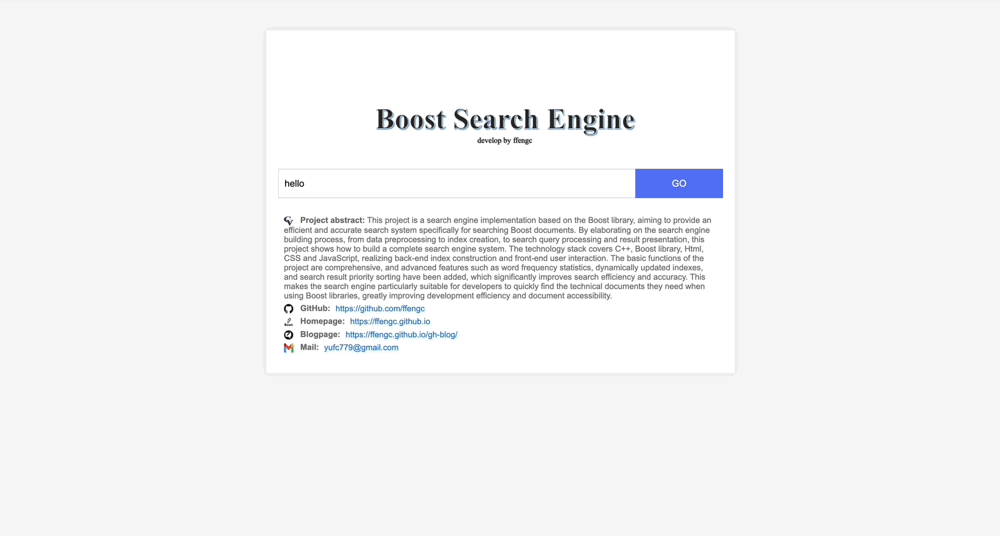
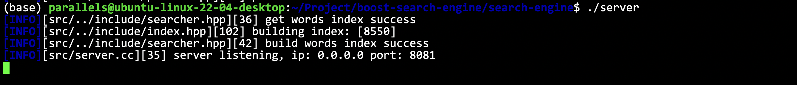

<div align="center">

# boost-search-engine

<a href="https://github.com/ffengc">
    
</a>
<a href="https://ffengc.github.io">
    
</a>
<a href="https://ffengc.github.io/gh-blog/">
    
</a>

</div>

- **[简体中文](./README-cn.md)**
- **[English](./README.md)**


## 📚Summary

This project is a search engine implementation based on the Boost library, aiming to provide an efficient and accurate search system specifically for searching Boost documents. By elaborating on the search engine building process, from data preprocessing to index creation, to search query processing and result presentation, this project shows how to build a complete search engine system. The technology stack covers C++, Boost library, Html, CSS and JavaScript, realizing back-end index construction and front-end user interaction. The basic functions of the project are comprehensive, and advanced features such as word frequency statistics, dynamically updated indexes, and search result priority sorting have been added, which significantly improves search efficiency and accuracy. This makes the search engine particularly suitable for developers to quickly find the technical documents they need when using Boost libraries, greatly improving development efficiency and document accessibility.

## 🏷️Project related information

### ⚽️How search engines work

Searching for a large number of documents and the content contained in the documents is obviously a very time-consuming and labor-intensive behavior. If you directly traverse and access them one by one, the service will basically not respond for a long time. For this reason, a faster and more convenient way is needed to plan and manage a large amount of data to achieve fast search. Building an index is the core of solving this problem.

The so-called index is to attach a label to the document and quickly search based on the label. Managing labels is much less stressful than managing documents, which is the essential reason for building an index.


### 🚙The significance of boost search engine


Boost library is a general term for some C++ libraries that provide extensions to the C++ language standard library. It is developed and maintained by the Boost community. Boost library can work perfectly with the C++ standard library and provide extended functions for it. The boost website provides a large number of documents. Implementing a search engine can help us find the documents we need accurately and quickly in a large number of documents.

### 💻Technology stack and project environment

- **Backend:** C/C+, C++11, STL, Boost, Jsoncpp, cppjieba, cpp-httplib

- **Frontend:** html5, css, js, jQuery, Ajax

## ✅Effect

Effect:



Backend effects:


## 📊Data preparation

Since the project does not implement crawler services, the method of downloading data to the local computer is adopted here. The data HTML file or directory can be placed in the following directory.

**Specific steps can be found at:**[word.md-chapter](./work.md#获取数据源)

`boost-search-engine/search-engine/data/input`

## ⚙️Service environment configuration

<details>
  <summary>Configuration and deployment</summary>

### Environment Configuration

> [!NOTE]
> The environment I use is: `Linux ubuntu-linux-22-04-desktop 5.15.0-113-generic #123-Ubuntu SMP Mon Jun 10 08:16:46 UTC 2024 aarch64 aarch64 aarch64 GNU/Linux`


#### Windows

**Install CMake:**
   - Download and install CMake: [page](https://cmake.org/download/)
   - Select during installation "Add CMake to the system PATH for all users" or "Add CMake to the system PATH for current user"。

**Install Visual Studio:**
   - Install Visual Studio 2019 or later, making sure to include the C++ Development Tools.
   - Download link: [Visual Studio](https://visualstudio.microsoft.com/downloads/)

**Install Boost library:**
   - Download Boost: [Boost official download page](https://www.boost.org/users/download/)
   - Unzip to a directory such as `C:\Libraries\boost_1_75_0`
   - Open a command prompt and run the following command:
     ```
     cd C:\Libraries\boost_1_75_0
     .\bootstrap.bat
     .\b2.exe
     ```
   - Set environment variables to set `BOOST_ROOT` to the directory where Boost is installed.

**Install jsoncpp:**
   - The easiest way is to install it via vcpkg:
     ```
     vcpkg install jsoncpp
     ```
   - Set the environment variable to point to the vcpkg installation directory.

**Configure CMake project:**
- Open CMake GUI.
- Set source directory and build directory.
- Click "Configure" and select the appropriate Visual Studio version.
- If CMake cannot find the library, set the path manually (e.g. `BOOST_ROOT`).
- Click "Generate" to generate Visual Studio solution files. d d

#### macOS

**Install Homebrew:**
   - Execute in the terminal:
     ```
     /bin/bash -c "$(curl -fsSL https://raw.githubusercontent.com/Homebrew/install/master/install.sh)"
     ```

**Install CMake and dependent libraries:**
   - Install CMake and other libraries via Homebrew:
     ```
     brew install cmake boost jsoncpp
     ```

**Configure CMake project:**
  - Open the terminal and go to the project directory.
  - Create and enter the build directory:
      ```
      mkdir build && cd build
      ```
  - Run CMake configuration and build commands:
      ```
      cmake ..
      make
      ```

#### Linux (Ubuntu, CentOS)

**Linux (Ubuntu, CentOS)**
   - Ubuntu:
     ```
     sudo apt-get update
     sudo apt-get install cmake g++ libboost-all-dev libjsoncpp-dev
     ```
   - CentOS:
     ```
     sudo yum install cmake gcc-c++ boost-devel jsoncpp-devel
     ```

**Configure CMake project:**
  - Create a build directory and enter it:
    ```
    mkdir build && cd build
    ```
  - Run CMake and make commands:
    ```
    cmake ..
    make
    ```

**You can also use `makefile` to compile directly:**

```
make
```

#### Precautions

> [!TIP]
> - Make sure the paths are set correctly on all platforms, especially on Windows, where you may need to manually set the paths to some libraries. 
> - For different Linux distributions, the installation commands and available packages may be slightly different, so adjust them accordingly. 
> - When building on Windows with Visual Studio, make sure to select the correct architecture (x86 or x64) to match the version of the library.

### Install jieba

**Official Links:**

> https://github.com/yanyiwu/cppjieba


Link the `cppjieba` directory into the project `boost-search-engine/search-engine/include` directory.


Enter the `cppjieba` directory

Link the `dict` dictionary library component and the `limonp` component into `cppjieba`.


</details>

## 🐳Deployment Service

### 🐧Deployment on Linux

Parse the data.

```bash
./parser
```


As shown in the figure, the operation is successful. If the operation fails, you can check the error message. It may be that the path configuration is incorrect. You can configure the path yourself in the code.

Start the service:



As shown in the figure, the startup is successful.

Of course, other methods can also be used to deploy to the background service, such as:

```sh
nohup ./server > log/log.txt 2>&1 &
```

You can also use some other methods, such as tmux, etc.

Use a browser to access the 8081 port number of the IP. The port number is set in `./src/server.cc`.

**The log part can be further improved.**

## 💼Implementation details

- **[work.md](./work.md) (only Chinese)**

## 📈To be optimized

0. Pause words can be added
1. Establish the whole site index
2. Design an online update plan, signal, crawler, and complete the equipment of the entire server
3. Instead of using components, design various corresponding solutions yourself (if you have time and energy)
4. Add bidding ranking to our search engine (strongly recommended)
5. Hot word statistics, intelligent display of search keywords (dictionary tree, priority queue)
6. Set up login and registration, and introduce the use of mysql (more recommended)