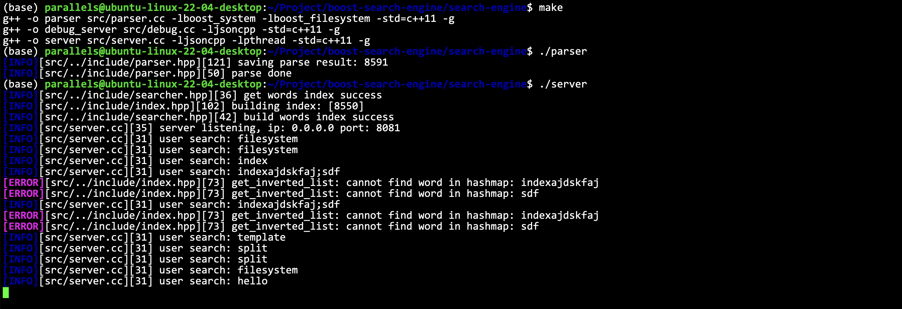
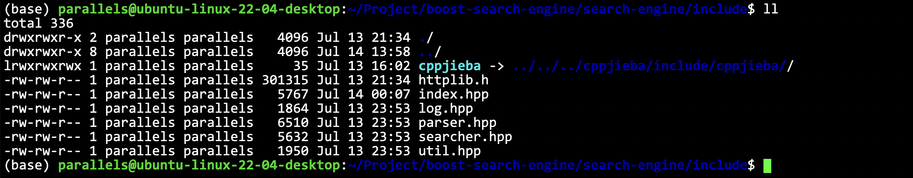
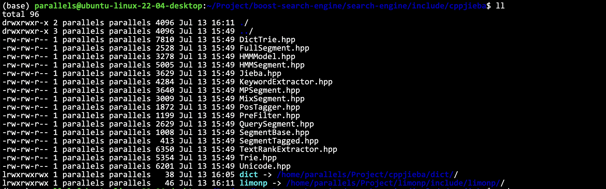

<div align="center">

# 基于Boost库的搜索引擎

<a href="https://github.com/ffengc">
    
</a>
<a href="https://ffengc.github.io">
    
</a>
<a href="https://ffengc.github.io/gh-blog/">
    
</a>

</div>

- **[简体中文](./README-cn.md)**
- **[English](./README.md)**

> [!NOTE]
> If you have any questions about the operation and implementation of this project, or if you have better optimization suggestions for this project, you can contact me directly or leave an issue in the repository.

## 📚摘要

这个项目是一个基于Boost库的搜索引擎实现，旨在提供一个高效和准确的搜索系统，专门用于搜索Boost文档。通过详细阐述搜索引擎的构建过程，从数据预处理到索引创建，再到搜索查询的处理和结果呈现，该项目展示了如何构建一个完整的搜索引擎系统。技术栈涵盖C++、Boost库、Html、CSS和JavaScript，实现了后端的索引构建和前端的用户交互。项目基本功能全面，还加入了词频统计、动态更新索引和搜索结果优先级排序等高级特性，显著提升了搜索效率和准确性。这使得该搜索引擎特别适合开发者在使用Boost库时快速查找所需的技术文档，极大地提高了开发效率和文档的可访问性。

## 🏷️项目相关信息

### ⚽️搜索引擎的原理

搜索大量的文档以及文档中包含的内容，显然是非常耗时耗力的一种行为。如果直接去一个个去遍历访问，基本会导致服务长时间得不到响应。为此需要更见快速以及便捷的方式去规划和管理大量的数据，实现快速查找，建立索引是解决这个问题的核心。

所谓的索引，就是将文档贴上一个标签，根据标签去快速查找。管理标签相对于管理文档的压力要小很多，这是建立索引的本质原因。


### 🚙boost搜索引擎的意义


boost库是为C++语言标准库提供扩展的一些C++程序库的总称，由Boost社区组织开发、维护。Boost库可以与C++标准库完美共同工作，并且为其提供扩展功能。boost网站提供了大量的文档，实现一个搜索引擎可以帮助我们在大量的文档中准确快速找到自己所需求的文档。

### 💻技术栈与项目环境

- **后端:** C/C++、C++11、STL、准标准库Boost、Jsoncpp、cppjieba、cpp-httplib

- **前端:** html5、css、js、jQuery、Ajax

## ✅实现效果

使用效果：


后端效果：



## 📊数据准备

由于项目没有实现爬虫服务，因此这里采用下载数据到本地的方式。数据HTML文件或目录放到以下目录即可。

**具体步骤可以见：**[word.md-获取数据源](./work.md#获取数据源)

`boost-search-engine/search-engine/data/input`

## ⚙️服务环境配置

<details>
  <summary>配置和部署</summary>

### 环境配置

> [!NOTE]
> 我使用的环境是：`Linux ubuntu-linux-22-04-desktop 5.15.0-113-generic #123-Ubuntu SMP Mon Jun 10 08:16:46 UTC 2024 aarch64 aarch64 aarch64 GNU/Linux`


#### Windows

**安装CMake:**
   - 下载并安装CMake：[CMake官方下载页](https://cmake.org/download/)
   - 在安装时选择"Add CMake to the system PATH for all users"或者"Add CMake to the system PATH for current user"。

**安装Visual Studio:**
   - 安装Visual Studio 2019或更高版本，确保包括C++开发工具。
   - 下载地址：[Visual Studio官方下载页](https://visualstudio.microsoft.com/downloads/)

**安装Boost库:**
   - 下载Boost：[Boost官方下载页](https://www.boost.org/users/download/)
   - 解压到一个目录，例如`C:\Libraries\boost_1_75_0`
   - 打开命令提示符，运行以下命令：
     ```
     cd C:\Libraries\boost_1_75_0
     .\bootstrap.bat
     .\b2.exe
     ```
   - 设置环境变量，将`BOOST_ROOT`设置为Boost的安装目录。

**安装jsoncpp:**
   - 最简单的方式是通过vcpkg安装：
     ```
     vcpkg install jsoncpp
     ```
   - 设置环境变量，指向vcpkg安装目录。

**配置CMake项目:**
   - 打开CMake GUI。
   - 设置源代码目录和构建目录。
   - 点击"Configure"，选择合适的Visual Studio版本。
   - 如果CMake无法找到库，手动设置路径（例如`BOOST_ROOT`）。
   - 点击"Generate"生成Visual Studio解决方案文件。

#### macOS

**安装Homebrew:**
   - 在终端执行：
     ```
     /bin/bash -c "$(curl -fsSL https://raw.githubusercontent.com/Homebrew/install/master/install.sh)"
     ```

**安装CMake和依赖库:**
   - 通过Homebrew安装CMake和其他库：
     ```
     brew install cmake boost jsoncpp
     ```

**配置CMake项目:**
   - 打开终端，转到项目目录。
   - 创建并进入构建目录：
     ```
     mkdir build && cd build
     ```
   - 运行CMake配置和构建命令：
     ```
     cmake ..
     make
     ```

#### Linux (Ubuntu, CentOS)

**安装CMake和必要的工具:**
   - Ubuntu:
     ```
     sudo apt-get update
     sudo apt-get install cmake g++ libboost-all-dev libjsoncpp-dev
     ```
   - CentOS:
     ```
     sudo yum install cmake gcc-c++ boost-devel jsoncpp-devel
     ```

**配置CMake项目:**
   - 创建一个构建目录，并进入：
     ```
     mkdir build && cd build
     ```
   - 运行CMake和make命令：
     ```
     cmake ..
     make
     ```

**也可以使用Makefile直接编译:**

```
make
```

#### 注意事项

- 确保在所有平台上路径设置正确，特别是在Windows上，可能需要手动设置一些库的路径。
- 对于不同的Linux发行版，安装命令和可用的包可能略有不同，请根据具体情况调整。
- 使用Visual Studio在Windows上构建时，确保选择正确的架构（x86或x64）以匹配库的版本。

### 安装jieba

**官方链接：**

> https://github.com/yanyiwu/cppjieba

将`cppjieba`目录链接到项目`boost-search-engine/search-engine/include`目录中。



进入`cppjieba`目录

将`dict`字典库组件和`limonp`组件链接到`cppjieba`中。



</details>

## 🐳部署服务

### 🐧部署到Linux上

对数据进行parse工作。

```bash
./parser
```


如图所示为运行成功，如果运行失败，可以检查错误信息，可能是路径配置有误，可以在代码中自行配置路径。

启动服务：


如图所示为启动成功。

当然也可以采用其他方式部署到后台服务，比如：

```sh
nohup ./server > log/log.txt 2>&1 &
```

同时也可以使用一些其他方法，比如tmux等等。

使用浏览器访问ip的8081端口号即可。端口号在`./src/server.cc`中设置。

**日志部分是可以继续完善的。**

## 💼实现细节

- **[work.md](./work.md) (仅有中文)**

## 📈待优化

0. 暂停词可以加一下
1. 建立整站索引
2. 设计一个在线更新的方案，信号，爬虫，完成整个服务器的设备
3. 不是用组件，而是自己设计一下对应的各种方案（有时间有精力）
4. 在我们的搜索引擎中，添加竞价排名（强烈推荐）
5. 热词统计，智能显示搜索关键词（字典树，优先级队列）
6. 设置登录注册，引入对mysql的使用（比较推荐）