# boost-search-engine

- [boost-search-engine](#boost-search-engine)
  - [搜索引擎的相关宏观原理](#搜索引擎的相关宏观原理)
  - [搜索引擎技术栈和项目环境](#搜索引擎技术栈和项目环境)
  - [正排索引和倒排索引](#正排索引和倒排索引)
    - [正排索引（Forward Index）](#正排索引forward-index)
    - [倒排索引（Inverted Index）](#倒排索引inverted-index)
  - [获取数据源](#获取数据源)
  - [编写数据去标签与数据清洗的模块 Parser](#编写数据去标签与数据清洗的模块-parser)
    - [数据准备](#数据准备)
    - [去标签是去什么](#去标签是去什么)
    - [去标签后的效果](#去标签后的效果)
    - [parser的基本结构](#parser的基本结构)
    - [枚举文件名](#枚举文件名)
    - [解析html](#解析html)
      - [解析title](#解析title)
      - [解析content](#解析content)
      - [解析url](#解析url)
    - [保存数据到二进制文件中](#保存数据到二进制文件中)
  - [编写建立索引的模块 Index](#编写建立索引的模块-index)
    - [准备工作](#准备工作)
    - [接口基本结构](#接口基本结构)
    - [构建索引](#构建索引)
      - [准备工作](#准备工作-1)
      - [正排索引](#正排索引)
      - [倒排索引](#倒排索引)
      - [处理一个遗留问题](#处理一个遗留问题)
  - [编写搜索引擎模块 Searcher](#编写搜索引擎模块-searcher)
    - [基本代码结构](#基本代码结构)
    - [把index设置成单例模式](#把index设置成单例模式)
    - [编写search功能](#编写search功能)
    - [编写测试用的 server 和收尾工作](#编写测试用的-server-和收尾工作)
  - [搭建网络服务](#搭建网络服务)
    - [`cpp-httplib`](#cpp-httplib)
    - [搭建基本结构](#搭建基本结构)
  - [搭建前端页面](#搭建前端页面)
    - [html和css](#html和css)
    - [js](#js)
  - [处理文档重复的问题](#处理文档重复的问题)

## 搜索引擎的相关宏观原理

宏观原理如图所示，即搜索页面是如何来的。

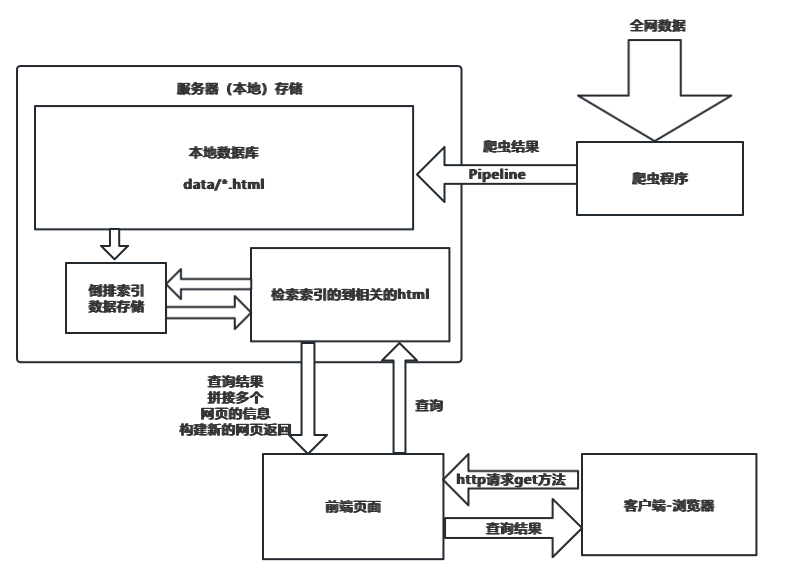

为了项目合法合规，我们不实现爬虫部分，我们会把需要的网页资源先下载下来，通过合法渠道。

## 搜索引擎技术栈和项目环境

- **后端:** `C/C++、C++11、STL、准标准库Boost、Jsoncpp、cppjieba、cpp-httplib`

- **前端:** `html5、css、js、jQuery、Ajax`

## 正排索引和倒排索引

一个简单的例子就能明白了。

正排索引和倒排索引是搜索引擎和信息检索系统中常用的两种数据结构。它们用于优化查询处理速度，提高搜索效率。

### 正排索引（Forward Index）
正排索引是一种直观的索引方式，它将文档映射到其中包含的词汇。在这种索引中，每个文档被指定一个文档ID，索引会存储每个文档ID对应的词汇列表。

**例子**：
假设我们有以下两个文档：
- 文档1: "苹果 香蕉 苹果 橙子"
- 文档2: "苹果 车厘子 香蕉"

正排索引将如下所示：
- 文档1: [苹果, 香蕉, 苹果, 橙子]
- 文档2: [苹果, 车厘子, 香蕉]

在这个索引中，我们可以直接通过文档ID查找到文档包含的所有词汇。

### 倒排索引（Inverted Index）
倒排索引与正排索引相反，它将词汇映射到包含这些词汇的文档。这种索引广泛用于搜索引擎，因为它使得根据词汇快速检索文档成为可能。

**例子**：
使用同样的文档，倒排索引将如下所示：
- 苹果: [文档1, 文档1, 文档2]
- 香蕉: [文档1, 文档2]
- 橙子: [文档1]
- 车厘子: [文档2]

在这个索引中，每个词汇都链接到一个文档列表，这些文档包含了该词汇。这使得在用户查询特定词汇时，搜索引擎能够快速找到包含这些词汇的所有文档。

## 获取数据源

前面提到了我们不会去实现爬虫相关的内容，因此这里先把数据下载下来。

boost的官方网站：[boost.org](https://www.boost.org)


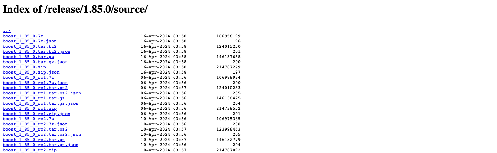

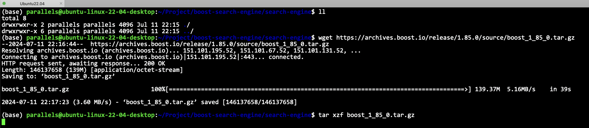

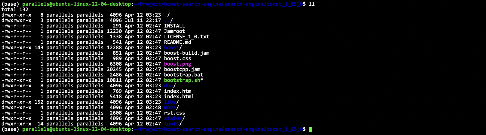

这里我们可以看到boost服务器上的所有内容。

> [!TIP]
> boost.org其实不太稳定，有时候会挂掉，因此我们完全可以利用自己的写的服务器把这个网站搭出来，在自己的网站上做搜索也是可以的。

## 编写数据去标签与数据清洗的模块 Parser

### 数据准备

先把数据(只需要html)放到我们的 input 目录下。

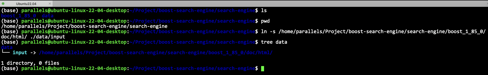

```bash
touch parser.cc # 去标签
```

### 去标签是去什么

```html
<!DOCTYPE html PUBLIC "-//W3C//DTD HTML 4.01 Transitional//EN" "http://www.w3.org/TR/html4/loose.dtd">
<html>
<head>
<meta http-equiv="Content-Type" content="text/html; charset=UTF-8">
<title>History</title>
<link rel="stylesheet" href="../../../doc/src/boostbook.css" type="text/css">
<meta name="generator" content="DocBook XSL Stylesheets V1.79.1">
<link rel="home" href="../index.html" title="The Boost C++ Libraries BoostBook Documentation Subset">
<link rel="up" href="../align.html" title="Chapter 3. Boost.Align">
<link rel="prev" href="acknowledgments.html" title="Acknowledgments">
<link rel="next" href="../any.html" title="Chapter 4. Boost.Any 1.2">
<meta name="viewport" content="width=device-width, initial-scale=1">
</head>
```

对于一个 html 来说, `<>`及其中间的内容就是标签，对于我们的搜索是没有价值的，需要去掉。

处理完之后的结果可以放到 `raw` 里面去。

```sh
(base) parallels@ubuntu-linux-22-04-desktop:~/Project/boost-search-engine/search-engine/data$ ll
total 16
drwxrwxr-x 3 parallels parallels 4096 Jul 11 22:36 ./
drwxrwxr-x 4 parallels parallels 4096 Jul 11 22:28 ../
lrwxrwxrwx 1 parallels parallels   80 Jul 11 22:26 input -> /home/parallels/Project/boost-search-engine/search-engine/boost_1_85_0/doc/html//
drwxrwxr-x 2 parallels parallels 4096 Jul 11 22:36 raw/
(base) parallels@ubuntu-linux-22-04-desktop:~/Project/boost-search-engine/search-engine/data$ 
```

有8000多个html等待我们处理

```sh
(base) parallels@ubuntu-linux-22-04-desktop:~/Project/boost-search-engine/search-engine/data$ cd input
(base) parallels@ubuntu-linux-22-04-desktop:~/Project/boost-search-engine/search-engine/data/input$ ls -Rl | grep -E "*.html" | wc -l 
8591
(base) parallels@ubuntu-linux-22-04-desktop:~/Project/boost-search-engine/search-engine/data/input$  
```

### 去标签后的效果

目标：把每一额文档都去掉标签，然后写入到同一个文件中！每个文档内容不需要任何的换行！文档和文档之间用特定的分割符，例如`\3` 进行区分。

```txt
xxxxxxxxxxxxxxxxxxxx\3yyyyyyyyyy\3zzzzzz
```

### parser的基本结构

```cpp
class parser {
private:
    const std::string __src_path = "data/input/";
    const std::string __raw_file = "data/raw/raw.bin";
private:
    typedef struct __doc_info {
        std::string __title;    // 文档标题
        std::string __content;  // 文档内容
        std::string __url;      // 文档url
    }doc_info_t;
public:
    void start() {
        // 1. 递归式的把每一个html文件名带路径，保存到 files_list 中，方便后期进行一个一个的文件读取
        std::vector<std::string> file_list;
        if(!enum_file(__src_path, &file_list)) {
            LOG(FATAL) << "enum_file error" << std::endl;
            exit(1);
        }
        //2. 按照file_list读取每个文件内容，并进行解析
        std::vector<doc_info_t> results;
        if(!parse_html(file_list, &results)) {
            LOG(FATAL) << "parse_html error" << std::endl;
            exit(2);
        }
        // 3. 把解析完毕的各个内容，写入到__raw_file对应的文件当中
        if(!save_html(results, __raw_file)) {
            LOG(FATAL) << "save_html error" << std::endl;
            exit(3);
        }
    };
public:
    static bool enum_file(const std::string& src_path, std::vector<std::string>* file_list) {}
    static bool parse_html(const std::vector<std::string>& file_list,  std::vector<doc_info_t>* results) {}
    static bool save_html(const std::vector<doc_info_t>& result, const std::string& raw_file) {}
};
```

基本代码结构如上所示。

### 枚举文件名

这里需要用boost库里面的一些方法

```cpp
    static bool enum_file(const std::string& src_path, std::vector<std::string>* file_list) {
        namespace fs = boost::filesystem;
        fs::path root_path(src_path);
        if (!fs::exists(root_path)) {
            LOG(ERROR) << "enum_file file not exists" << std::endl;
            return false;
        }
        fs::recursive_directory_iterator end; // 定义一个空的迭代器，用来判断递归结束
        for (fs::recursive_directory_iterator iter(root_path); iter != end; iter++) {
            if (!fs::is_regular_file(*iter)) // 如果不是普通文件
                continue;
            if (iter->path().extension() != ".html") // 如果后缀不是 html
                continue;
            //  当前的路径一定是一个html结束的普通网页文件
            // LOG(DEBUG) << iter->path().string() << std::endl;
            file_list->push_back(iter->path().string());
        }
        return true;
    }
```

可以打印一下结果看看对不对: `LOG(DEBUG) << iter->path().string() << std::endl;`

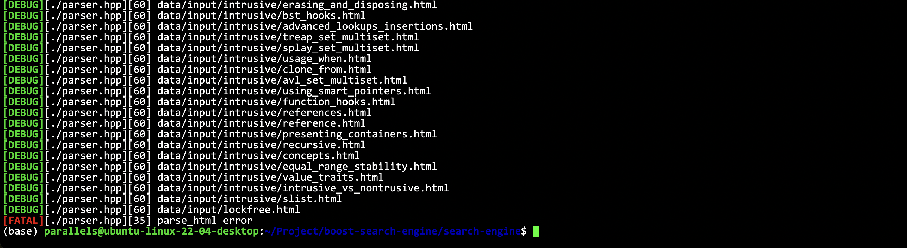


### 解析html

```cpp
    static bool parse_html(const std::vector<std::string>& file_list, std::vector<doc_info_t>* results) {
        for (const std::string& file : file_list) {
            // 1. 读取文件 read()
            std::string result;
            if (!ns_util::file_util::read_file(file, &result))
                continue;
            // 2. 解析指定的文件，提取title
            doc_info_t doc;
            if (!parse_title(result, &doc.__title))
                continue;
            // 3. 解析指定的文件，提取content
            if (!parse_content(result, &doc.__content))
                continue;
            // 4. 解析指定的文件路径，构建url
            if (!parse_url)
                continue;
            // 走到这里一定是完成了解析任务，当前文档的相关结果都保存在了doc里面
            results->push_back(doc); // 细节，本质会发生拷贝，待优化
        }
        return true;
    }
```

这个是非常好理解的，一步一步解析就可以了。

```cpp
    static bool parse_title(const std::string& input, std::string* title) {
    }
    static bool parse_content(const std::string& input, std::string* content) {
    }
    static bool parse_url(/*?*/) {
    }
```

#### 解析title

这一部分很简单，把`<title>`和`</title>`之间的东西拿出来就行了。

```cpp
    static bool parse_title(const std::string& file, std::string* title) {
        // 提取title
        std::size_t begin = file.find("<title>");
        if (begin == std::string::npos)
            return false;
        std::size_t end = file.find("</title>");
        if (begin == std::string::npos)
            return false;
        begin += std::string("<title>").size();
        if (begin > end) {
            return false;
        }
        *title = file.substr(begin, end - begin); // 提取title
        return true;
    }
```

#### 解析content

这里我基于一个小型的状态机来实现。两种状态：`LABLE`和`CONTENT`。

```cpp
    static bool parse_content(const std::string& file, std::string* content) {
        // 去标签, 基于一个简易的状态机去写
        enum status {
            LABLE,
            CONTENT
        };
        enum status s = LABLE;
        for (char c : file) {
            switch (s) {
            case LABLE:
                if (c == 'c') // 此时标签已经被处理完毕了
                    s = CONTENT;
                break;
            case CONTENT:
                if (c == '<')
                    s = LABLE;
                else {
                    // 我们不想保留 \n
                    if (c == '\n')
                        c = ' ';
                    content->push_back(c);
                }
                break;
            default:
                break;
            }
        }
    }
```

#### 解析url

> [!TIP]
> boost库的官方文档和我们下载的资源是有路径的对应关系的

官方文档路径：`https://www.boost.org/doc/libs/1_85_0/doc/html/accumulators.html`
数据的路径：`data/input/accumulators.html`

对应关系处理好就行了。

```cpp
static const std::string url_head = "https://www.boost.org/doc/libs/1_85_0/doc/html";
```

```cpp
    static bool parse_url(const std::string& file_path, std::string* url) {
        std::string url_tail = file_path.substr(src_path.size());
        *url = url_head + url_tail;
        return true;
    } 
```

### 保存数据到二进制文件中

优化写入到格式。

能了能够使用`std::getline`方法直接读取一个文件里面的所有东西，所以定义规则为：

> [!TIP]
> `title\3content\3url \n title\3content\3url \n title\3content\3url`

## 编写建立索引的模块 Index

### 准备工作

```cpp
namespace ns_index {
typedef struct __doc_info {
    std::string __title; // 文档标题
    std::string __content; // 文档内容
    std::string __url; // 文档url
    int __doc_id; // 文档的id
} doc_info_t;
class index {
    private:
};
```

这里相对于前面parser部分，这里弄多了一个 `int __doc_id; // 文档的id`，后面具体如何使用后面再说。

所以，我们直接建立正排索引的数据结构就行了。

```cpp
std::vector<doc_info_t> __forward_index; // 正排索引
```

那么倒排索引，前面我们提到了，这个是一个关键字到文档的一个映射。

关键字有哪些呢？要先处理一下。

```cpp
struct inverted_elem {
    int __doc_id;
    std::string __word;
    int __weight;
};
```
**因此倒排索引一定是一个关键字和一组（个）inverted_elem对应的！**

因此，可以设置倒排索引的数据结构：

```cpp
typedef std::vector<inverted_elem> inverted_list_t;
std::unordered_map<std::string, inverted_list_t> __inverted_index; // 倒排索引
```

### 接口基本结构

```cpp
    // 根据doc_id找到文档内容
    doc_info_t* get_forward_index(const uint64_t& doc_id) {
        return nullptr;
    }
    // 根据关键字，获得倒排拉链
    inverted_list_t* get_inverted_list(const std::string& word) {
        return nullptr;
    }
    // 根据去标签格式化之后的文档，构建正排和倒排索引
    bool build_index(const std::string& input) {
        // input: raw.bin
        return true;
    }
```

### 构建索引

#### 准备工作

这一部分是非常重要。其他部分，比如返回正排索引倒排索引，其实就是在`vector`，`hash_map`里面拿东西而已，都是非常简单的，所以最关键的，就是构建索引部分的逻辑。

```cpp
        std::ifstream in(input, std::ios::in | std::ios::binary);
        if (!in.is_open()) {
            LOG(ERROR) << "path file: " << input << " open error" << std::endl;
            return false;
        }
        std::string line;
        std::size_t cnt = 0; // 表示第几行
        while (std::getline(in, line)) {
            // 建立正排索引
            doc_info* doc = __build_forward_index(line);
            if (doc == nullptr) {
                LOG(WARNING) << "build_forward_index error in line:" << cnt << std::endl;
                continue;
            }
            // 建立倒排索引
            __build_inverted_index(*doc);
            cnt++;
        }
```

所以我们要写两个私有的接口来建立正排索引和倒排索引。

#### 正排索引

步骤如下所示：

1. 解析line, 字符串切分
2. 字符串进行填充到docinfo
3. 插入到正排索引的vector中

所以我们需要一个把字符串一分为三的函数，可以直接放到`util.hpp`里面去。

```cpp
    doc_info* __build_forward_index(const std::string& line) {
        // 1. 解析line, 字符串切分
        std::vector<std::string> results; // 最终
        ns_util::string_util::cut_string(line, &results, sep);
        if (results.size() != 3)
            // 切分出错了
            return nullptr;
        // 2. 字符串进行填充到docinfo
        doc_info doc;
        doc.__title = results[0]; 
        doc.__content = results[1];
        doc.__title = results[2];
        doc.__doc_id = __forward_index.size();
        // 3. 插入到正排索引的vector中
        __forward_index.push_back(doc);
        return &__forward_index.back();
    }
```

然后切分字符串可以用boost库里面的方法：

```cpp
    static void cut_string(const std::string& target, std::vector<std::string>* out, char sep) {
        // boost split
        boost::split(*out, target, boost::is_any_of(sep), boost::token_compress_on);
    }
```


#### 倒排索引

原理：
- 接口拿到的是一个格式化的内容，标题，内容等
- 因为当前我们是一个一个文档进行处理的，一个文档会包含多个词，都应当到当前的doc_id
- 最终目的：根据文档内容，形成一个或者多个`inverted_elem`
- 所以需要对标题和内容都要先进行分词操作
- 然后要进行词频统计，然后我们也可以特定设置，在标题中出现的词，可以认为相关性更高一些
- 做完上面的步骤之后，就可以知道在文档中，标题和内容每个词出现的次数
- 然后我们就需要自定义相关性，设置：标题里面的相关性为10，内容中的相关性为1

**cppjieba安装：**

> [!TIP]
> https://github.com/yanyiwu/cppjieba

cppjieba是header only的，所以直接包含他的头文件即可了。`include/cpp/*.hpp`

具体细节可以看cppjieba的readme

我们只需要用cppjieba的CutForSearch部分功能，它里面有很多功能。

**需要看他的demo.cpp**

注意：需要手动把 `cppjieba/deps/limonp` 的内容拷贝到 `cppjieba/include/cppjieba` 里面去，否则编译会不通过

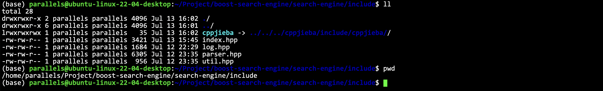

把jieba放到对应的头文件目录中。

把`limonp`链接过来。

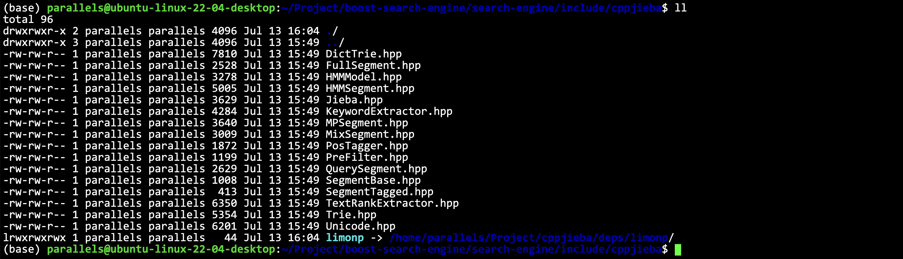

把词库引过来。

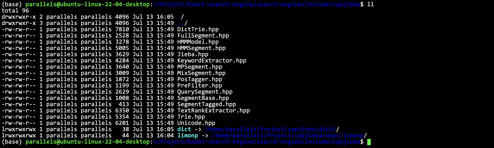

因为jieba不仅仅是在倒排索引这里要用，在后面search的时候也要用的，所以放到`util.hpp`里面统一去管理。

词库需要引入并处理好路径，然后调用`CutForSearch`就行了。

```cpp
const char* const DICT_PATH = "./cppjieba/dict/jieba.dict.utf8";
const char* const HMM_PATH = "./cppjieba/dict/hmm_model.utf8";
const char* const USER_DICT_PATH = "./cppjieba/dict/user.dict.utf8";
const char* const IDF_PATH = "./cppjieba/dict/idf.utf8";
const char* const STOP_WORD_PATH = "./cppjieba/dict/stop_words.utf8";
class jieba_util {
private:
    static cppjieba::Jieba jieba;
public:
    void cut_string(const std::string& src, std::vector<std::string>* out) {
        jieba.CutForSearch(src, *out);
    }
};
cppjieba::Jieba jieba_util::jieba(DICT_PATH, HMM_PATH, USER_DICT_PATH, IDF_PATH, STOP_WORD_PATH); // static 要在类外来定义
```

因此我们就可以完善建立倒排索引的代码了。

```cpp
    bool __build_inverted_index(const doc_info& doc) {
        struct word_count {
            int title_count;
            int content_count;
            word_count()
                : title_count(0)
                , content_count(0) { }
        };
        std::unordered_map<std::string, word_count> word_map; // 用来暂存词频的映射表
        // 标题分词
        std::vector<std::string> title_words;
        ns_util::jieba_util::cut_string(doc.__title, &title_words);
        for (auto& s : title_words)
            word_map[s].title_count++;
        // 内容分词
        std::vector<std::string> content_words;
        ns_util::jieba_util::cut_string(doc.__content, &content_words);
        for (auto& s : content_words)
            word_map[s].content_count++;
        // 构建倒排拉链
        for (auto& word_pair : word_map) {
            inverted_elem item;
            item.__doc_id = doc.__doc_id;
            item.__word = word_pair.first;
            item.__weight = title_co_rate * (word_pair.second.title_count) + content_co_rate * (word_pair.second.content_count); // 相关性
            // 把东西放进去
            inverted_list_t & inverted_list = __inverted_index[word_pair.first];
            inverted_list.push_back(item);
        }
    }
```

#### 处理一个遗留问题

很明显，搜索引擎是不会区分大小写的，所以我们要处理一下。

## 编写搜索引擎模块 Searcher

### 基本代码结构

建立索引是第一步，后面我们就要根据索引去进行搜索了。

```cpp
namespace ns_searcher {
class searcher {
private:
    ns_index::index* __index; // 供系统进行查找的索引
public:
    searcher() = default;
    ~searcher() = default;

public:
    void init_searcher(const std::string& input) {
        // 1. 获取或者创建index对象
        // 2. 根据index对象建立索引
    }
    void search(const std::string& query, std::string* json_string) {
        // query: 搜索关键字
        // json_string: 返回用户浏览器的搜索结果
        // 1. 对query分词
        // 2. 触发：就是根据分词的各个词，进行index查找
        // 3. 合并排序：汇总查找结果，按照相关性进行降序排序
        // 4. 构建：根据查找出来的结果构建json串，jsoncpp
    }
};
} // namespace ns_searcher
```

如何进行搜索：
1. 对query分词
2. 触发：就是根据分词的各个词，进行index查找
3. 合并排序：汇总查找结果，按照相关性进行降序排序
4. 构建：根据查找出来的结果构建json串，jsoncpp

### 把index设置成单例模式

因为基本上index构造一次之后后面都不会变的了，因此设置成单例，避免在程序中有过多的index对象。

然后构造单例会有线程安全问题，所以要加锁，不过这一部分都是C++和系统的知识了，这里不多叙述，具体可以见代码。

### 编写search功能

按照这个步骤来写就没问题了。
1. 对query分词
2. 触发：就是根据分词的各个词，进行index查找
3. 合并排序：汇总查找结果，按照相关性进行降序排序
4. 构建：根据查找出来的结果构建json串，jsoncpp

```cpp
    void search(const std::string& query, std::string* json_string) {
        // query: 搜索关键字
        // json_string: 返回用户浏览器的搜索结果
        // 1. 对query分词
        std::vector<std::string> query_words;
        ns_util::jieba_util::cut_string(query, &query_words);
        // 2. 触发：就是根据分词的各个词，进行index查找
        // 注意大小写，这里需要忽略大小写
        ns_index::inverted_list_t inverted_list_all; // 内部是 inverted_elem
        for (std::string word : query_words) {
            boost::to_lower(word);
            // 必须先查倒排
            ns_index::inverted_list_t* inverted_list = __index->get_inverted_list(word); // 找倒排
            if (nullptr == inverted_list)
                // 没有倒排就一定没有正排
                continue;
            inverted_list_all.insert(inverted_list_all.end(), inverted_list->begin(), inverted_list->end()); // 批量化插入
            // 这里的 inverted_list_all 可能会有遗留问题，可能文档名是有重复的
        }
        // 3. 合并排序：汇总查找结果，按照相关性进行降序排序
        std::sort(inverted_list_all.begin(), inverted_list_all.end(), [](const ns_index::inverted_elem& e1, const ns_index::inverted_elem& e2) {
            return e1.__weight > e2.__weight;
        });
        // 4. 构建：根据查找出来的结果构建json串，jsoncpp
        for (auto& item : inverted_list_all) {
            ns_index::doc_info* doc = __index->get_forward_index(item.__doc_id);
            if(nullptr == doc) continue;
            // 序列化
        }
    }
```

拿到结果之后，就要按照jsoncpp了，因为先准备需要序列化了。

**安装jsoncpp**

我是ubuntu22.04

> [!TIP]
> sudo apt install libjsoncpp-dev

如果是centos

> [!TIP]
> sudo yum install -y jsoncpp-devel


然后引入对应的头文件 `#include <jsoncpp/json/json.h>` 我是这个路径，具体要看版本和情况。

makefile也要带上链接库: `-ljsoncpp`。


然后我们就可以完成序列化的步骤了：

```cpp
        // 4. 构建：根据查找出来的结果构建json串，jsoncpp
        Json::Value root;
        for (auto& item : inverted_list_all) {
            ns_index::doc_info* doc = __index->get_forward_index(item.__doc_id);
            if (nullptr == doc)
                continue;
            // 序列化
            Json::Value elem;
            elem["title"] = doc->__title;
            // doc->__content 是去标签的全部结果，不是我们想要的，我们想要的只有一部分。TODO
            elem["desc"] = doc->__content;
            elem["url"] = doc->__url;
            root.append(elem); // 按顺序append到root中了
        }
        Json::StyledWriter writer;
        *json_string = writer.write(root); // 序列化！
```

### 编写测试用的 server 和收尾工作

```cpp
#include "../include/searcher.hpp"

const std::string input = "./data/raw/raw.bin";

int main() {
    // for test
    ns_searcher::searcher * ser = new ns_searcher::searcher();
    ser->init_searcher(input);
    std::string query;
    std::string json_string;
    while(true) {
        std::cout << "input Query# ";
        std::cin >> query;
        ser->search(query, &json_string);
        std::cout << json_string << std::endl;
    }
    return 0;
}
```

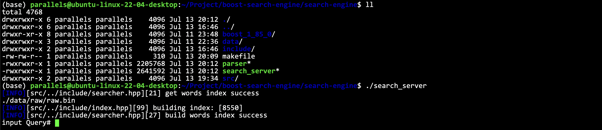

输入 Query 为 filesystem 看看结果，点开链接看看对不对就行了。

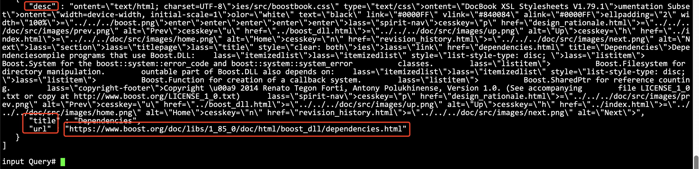

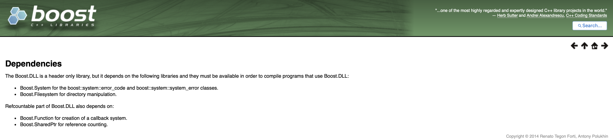

打开确实没问题，这就说明我们的逻辑没毛病了。当然还需要相关的测试。

先把摘要建立过程搞好。

总不能给浏览器客户端返回全文吧。

当然建立摘要最简单的，就是直接截取前100字节，但是也不太好。我们想搞一个好一点的摘要，能体现内容的。最好就是接一个AI接口来生成摘要，不过这里简化了这个方法。

策略如下：

```cpp
    std::string get_desc(const std::string& html_content, const std::string& word) {
        // 找到word在html_content中的首次出现，然后往前找n个字节，往后找m个字节，截取出这部分内容
    }
```

这里面有非常多的细节需要注意！写代码的时候要多调试才能找到问题。
```cpp
    std::string get_desc(const std::string& html_content, const std::string& word) {
        // 找到word在html_content中的首次出现，然后往前找n个字节，往后找m个字节，截取出这部分内容
        const int prev_step = 150;
        const int next_step = 180;
        // 1. 找到首次出现
        auto iter = std::search(html_content.begin(), html_content.end(), word.begin(), word.end(), [](int x, int y) { return std::tolower(x) == std::tolower(y); });
        if (iter == html_content.end())
            return "null: iter == html_content.end()"; // 这种情况是不可能存在的, 因为文本里一定有关键字word
        std::size_t pos = std::distance(html_content.begin(), iter);
        // 2. 获取start，end
        int start = 0; // 不能用size_t防止减成负数
        int end = html_content.size() - 1;
        if (pos > start + prev_step)
            start = pos - prev_step;
        if ((int)pos < (int)(end - next_step))
            end = pos + next_step;cle
        // 3. 截取字串
        if (start >= end)
            return "null: start >= end"; // 不可能情况
        return html_content.substr(start, end - start);
    }
```

## 搭建网络服务

### `cpp-httplib`

使用cpp-httplib第三方库。

> [!NOTE]
> https://github.com/yhirose/cpp-httplib


> [!WARNING]
> 1. 要使用较新版本的gcc/g++, 我的版本是`gcc version 11.4.0 (Ubuntu 11.4.0-1ubuntu1~22.04) `
> 2. 这个是headeronly的，直接包含头文件就可以了
> 3. 有一些系统每次启动新bash的时候，gcc版本都会回到旧版：可以把启动命令放到`~/.bash_profile`中去，当然有些系统本来就是最新版，具体升级可以搜索其他相关资料
> 4. 建议使用 cpphttplib 的 0.7.15版本, 如果用最新的，那建议gcc也是最新的
> 5. 使用的时候要带 `-lpthread`

### 搭建基本结构

```cpp
void build_server() {
    // 定义searcher
    ns_searcher::searcher ser;
    ser.init_searcher(resource_path);

    httplib::Server svr;
    svr.set_base_dir(root_path.c_str());
    svr.Get("/s", [&ser](const httplib::Request& req, httplib::Response& rsp) {
        // 设置用户输入的关键字的参数名为 word
        if (!req.has_param("word")) {
            rsp.set_content("none key word, please enter your param", "text/plain; charset=utf-8");
            return;
        }
        // 有关键字
        std::string word = req.get_param_value("word");
        std::string json_string; // 这个是搜索结果
        ser.search(word, &json_string);
        rsp.set_content(json_string, "application/json; charset=utf-8");
    });
    svr.listen("0.0.0.0", 8081);
}
```
通过这样，我们就可以通过关键字进行搜索了。

可以先稍微测试一下：

在浏览器输入: `http://10.211.55.4:8081/s?word=filesystem` 其中 ip 是自己服务器的ip

> [!NOTE]
> `/s`是我们设置GET方法的时候设置的搜索路径，然后?word=filesystem表示我们的参数名是word，内容是filesystem，在上面这份搜索代码中，表示搜索filesystem的内容。

可以看到浏览器输出的结果：

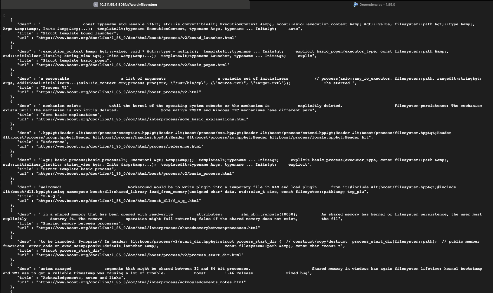

当然，后续我们要开始把这些内容整理到前端上了！

## 搭建前端页面

### html和css

细节略。见代码。

### js

然后我们肯定要用一下jQuery。我用的是这个源。

```html
<script src="http://code.jquery.com/jquery-2.1.1.min.js"></script>
```

## 处理文档重复的问题

为什么会有文档重复问题。

比如一个文档里面有: I am a `student programmer`.

此时如果搜索: `student programmer`。可能就搜出来两个文档在页面中，指向的都是同一个文档。这个也是很好理解的。

如何处理这个问题？

我们可以另外定一个一个专门用来打印的倒排拉链节点。

```cpp
struct inverted_elem_print {
    uint64_t __doc_id;
    int __weight;
    std::vector<std::string> __words;
    inverted_elem_print()
        : __doc_id(0)
        , __weight(0) { }
};
```

维护一个建立用来去重的数据结构：

```cpp
std::unordered_map<uint64_t, inverted_elem_print> token_map;
```