# boost-search-engine

- **[简体中文](./work-cn.md)**
- **[English](./work.md)**

- [boost-search-engine](#boost-search-engine)
  - [Macro-level Principles of Search Engines](#macro-level-principles-of-search-engines)
  - [Search Engine Technology Stack and Project Environment](#search-engine-technology-stack-and-project-environment)
  - [Forward Index and Inverted Index](#forward-index-and-inverted-index)
    - [Forward Index](#forward-index)
    - [Inverted Index](#inverted-index)
  - [Obtaining the Data Source](#obtaining-the-data-source)
  - [Building the Tag Removal and Data Cleaning Module: Parser](#building-the-tag-removal-and-data-cleaning-module-parser)
    - [Data Preparation](#data-preparation)
    - [What Does Tag Removal Mean](#what-does-tag-removal-mean)
    - [Expected Result After Tag Removal](#expected-result-after-tag-removal)
    - [Basic Structure of the Parser](#basic-structure-of-the-parser)
    - [Enumerating File Names](#enumerating-file-names)
    - [Parsing HTML](#parsing-html)
      - [Parsing the Title](#parsing-the-title)
      - [Parsing the Content](#parsing-the-content)
      - [Parsing the URL](#parsing-the-url)
    - [Saving Data to a Binary File](#saving-data-to-a-binary-file)
  - [Building the Index Module](#building-the-index-module)
    - [Preparation](#preparation)
    - [Basic Interface Structure](#basic-interface-structure)
    - [Building the Index](#building-the-index)
      - [Preparation](#preparation-1)
      - [Forward Index](#forward-index-1)
      - [Inverted Index](#inverted-index-1)
      - [Handling a Remaining Issue](#handling-a-remaining-issue)
  - [Building the Searcher Module](#building-the-searcher-module)
    - [Basic Code Structure](#basic-code-structure)
    - [Making the Index a Singleton](#making-the-index-a-singleton)
    - [Implementing the Search Function](#implementing-the-search-function)
    - [Building the Test Server and Finishing Up](#building-the-test-server-and-finishing-up)
  - [Setting Up the Network Service](#setting-up-the-network-service)
    - [`cpp-httplib`](#cpp-httplib)
    - [Building the Basic Structure](#building-the-basic-structure)
  - [Building the Frontend Page](#building-the-frontend-page)
    - [HTML and CSS](#html-and-css)
    - [JavaScript](#javascript)
  - [Handling the Duplicate Document Problem](#handling-the-duplicate-document-problem)

## Macro-level Principles of Search Engines

The macro-level principle is shown in the figure below — how search result pages are generated.

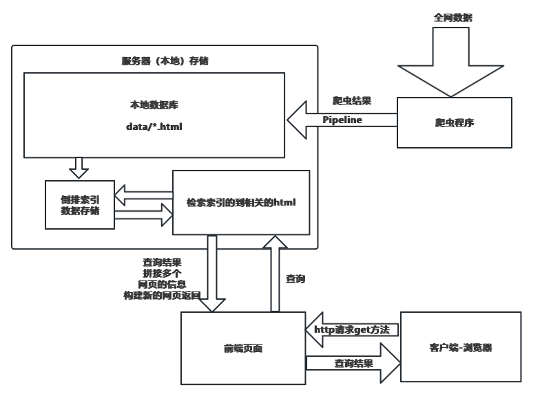

To keep the project legal and compliant, we do not implement a web crawler. Instead, we download the required web resources through legitimate channels in advance.

## Search Engine Technology Stack and Project Environment

- **Backend:** `C/C++, C++11, STL, Boost, Jsoncpp, cppjieba, cpp-httplib`

- **Frontend:** `html5, css, js, jQuery, Ajax`

## Forward Index and Inverted Index

A simple example will make this clear.

The forward index and inverted index are two commonly used data structures in search engines and information retrieval systems. They are used to optimize query processing speed and improve search efficiency.

### Forward Index
The forward index is an intuitive indexing approach that maps documents to the terms they contain. In this type of index, each document is assigned a document ID, and the index stores the list of terms corresponding to each document ID.

**Example:**
Suppose we have the following two documents:
- Document 1: "apple banana apple orange"
- Document 2: "apple cherry banana"

The forward index would look like this:
- Document 1: [apple, banana, apple, orange]
- Document 2: [apple, cherry, banana]

In this index, we can directly look up all the terms contained in a document by its document ID.

### Inverted Index
The inverted index is the reverse of the forward index — it maps terms to the documents that contain them. This type of index is widely used in search engines because it enables fast document retrieval based on terms.

**Example:**
Using the same documents, the inverted index would look like this:
- apple: [Document 1, Document 1, Document 2]
- banana: [Document 1, Document 2]
- orange: [Document 1]
- cherry: [Document 2]

In this index, each term is linked to a list of documents that contain it. This allows the search engine to quickly find all documents containing the queried terms.

## Obtaining the Data Source

As mentioned earlier, we will not implement anything related to web crawlers, so we need to download the data beforehand.

Boost official website: [boost.org](https://www.boost.org)


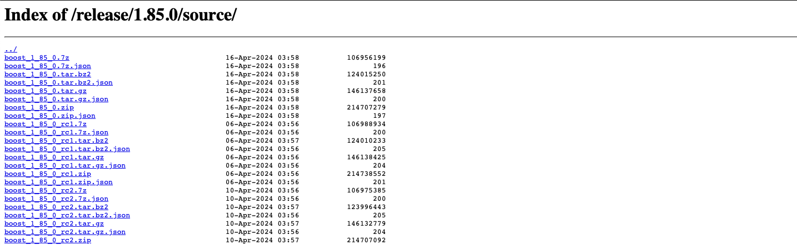

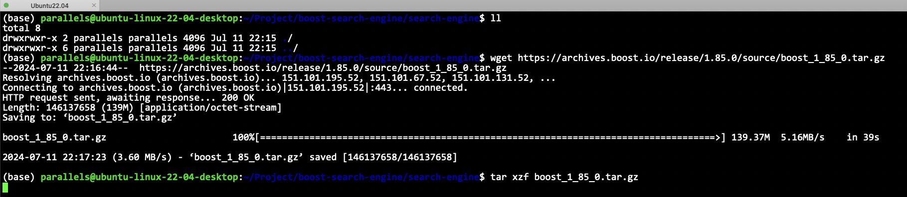

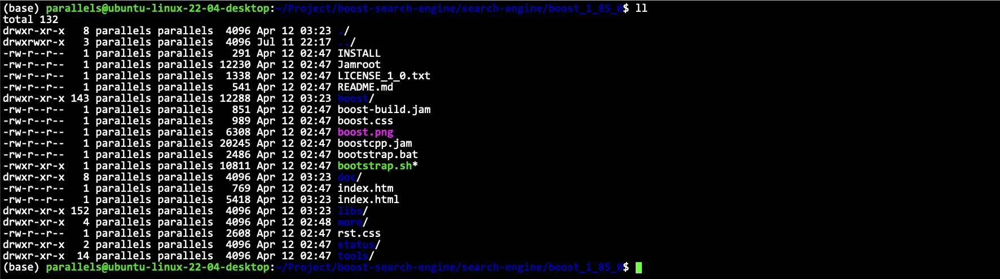

Here we can see all the content on the Boost server.

> [!TIP]
> boost.org is not always stable and may go down occasionally. Therefore, we can use our own server to host a copy of the website and perform searches on our own site.

## Building the Tag Removal and Data Cleaning Module: Parser

### Data Preparation

First, place the data (only HTML files are needed) into our `input` directory.

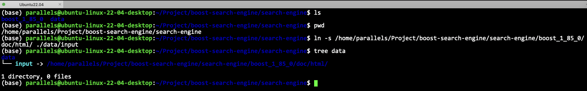

```bash
touch parser.cc # tag removal
```

### What Does Tag Removal Mean

```html
<!DOCTYPE html PUBLIC "-//W3C//DTD HTML 4.01 Transitional//EN" "http://www.w3.org/TR/html4/loose.dtd">
<html>
<head>
<meta http-equiv="Content-Type" content="text/html; charset=UTF-8">
<title>History</title>
<link rel="stylesheet" href="../../../doc/src/boostbook.css" type="text/css">
<meta name="generator" content="DocBook XSL Stylesheets V1.79.1">
<link rel="home" href="../index.html" title="The Boost C++ Libraries BoostBook Documentation Subset">
<link rel="up" href="../align.html" title="Chapter 3. Boost.Align">
<link rel="prev" href="acknowledgments.html" title="Acknowledgments">
<link rel="next" href="../any.html" title="Chapter 4. Boost.Any 1.2">
<meta name="viewport" content="width=device-width, initial-scale=1">
</head>
```

For an HTML file, `<>` tags and their enclosed content are meaningless for our search purposes and need to be removed.

The processed results can be stored in the `raw` directory.

```sh
(base) parallels@ubuntu-linux-22-04-desktop:~/Project/boost-search-engine/search-engine/data$ ll
total 16
drwxrwxr-x 3 parallels parallels 4096 Jul 11 22:36 ./
drwxrwxr-x 4 parallels parallels 4096 Jul 11 22:28 ../
lrwxrwxrwx 1 parallels parallels   80 Jul 11 22:26 input -> /home/parallels/Project/boost-search-engine/search-engine/boost_1_85_0/doc/html//
drwxrwxr-x 2 parallels parallels 4096 Jul 11 22:36 raw/
(base) parallels@ubuntu-linux-22-04-desktop:~/Project/boost-search-engine/search-engine/data$
```

There are over 8,000 HTML files waiting to be processed:

```sh
(base) parallels@ubuntu-linux-22-04-desktop:~/Project/boost-search-engine/search-engine/data$ cd input
(base) parallels@ubuntu-linux-22-04-desktop:~/Project/boost-search-engine/search-engine/data/input$ ls -Rl | grep -E "*.html" | wc -l
8591
(base) parallels@ubuntu-linux-22-04-desktop:~/Project/boost-search-engine/search-engine/data/input$
```

### Expected Result After Tag Removal

Goal: Remove all tags from each document, then write them into a single file. Each document's content should have no line breaks. Documents are separated by a specific delimiter, such as `\3`.

```txt
xxxxxxxxxxxxxxxxxxxx\3yyyyyyyyyy\3zzzzzz
```

### Basic Structure of the Parser

```cpp
class parser {
private:
    const std::string __src_path = "data/input/";
    const std::string __raw_file = "data/raw/raw.bin";
private:
    typedef struct __doc_info {
        std::string __title;    // document title
        std::string __content;  // document content
        std::string __url;      // document URL
    }doc_info_t;
public:
    void start() {
        // 1. Recursively save each HTML file name with its path into file_list for later file-by-file reading
        std::vector<std::string> file_list;
        if(!enum_file(__src_path, &file_list)) {
            LOG(FATAL) << "enum_file error" << std::endl;
            exit(1);
        }
        // 2. Read each file according to file_list and parse it
        std::vector<doc_info_t> results;
        if(!parse_html(file_list, &results)) {
            LOG(FATAL) << "parse_html error" << std::endl;
            exit(2);
        }
        // 3. Write the parsed content to the file specified by __raw_file
        if(!save_html(results, __raw_file)) {
            LOG(FATAL) << "save_html error" << std::endl;
            exit(3);
        }
    };
public:
    static bool enum_file(const std::string& src_path, std::vector<std::string>* file_list) {}
    static bool parse_html(const std::vector<std::string>& file_list,  std::vector<doc_info_t>* results) {}
    static bool save_html(const std::vector<doc_info_t>& result, const std::string& raw_file) {}
};
```

The basic code structure is shown above.

### Enumerating File Names

Here we need to use some methods from the Boost library:

```cpp
    static bool enum_file(const std::string& src_path, std::vector<std::string>* file_list) {
        namespace fs = boost::filesystem;
        fs::path root_path(src_path);
        if (!fs::exists(root_path)) {
            LOG(ERROR) << "enum_file file not exists" << std::endl;
            return false;
        }
        fs::recursive_directory_iterator end; // define an empty iterator to determine the end of recursion
        for (fs::recursive_directory_iterator iter(root_path); iter != end; iter++) {
            if (!fs::is_regular_file(*iter)) // if it's not a regular file
                continue;
            if (iter->path().extension() != ".html") // if the extension is not .html
                continue;
            // At this point, the current path must be a regular HTML file
            // LOG(DEBUG) << iter->path().string() << std::endl;
            file_list->push_back(iter->path().string());
        }
        return true;
    }
```

You can print the results to verify: `LOG(DEBUG) << iter->path().string() << std::endl;`

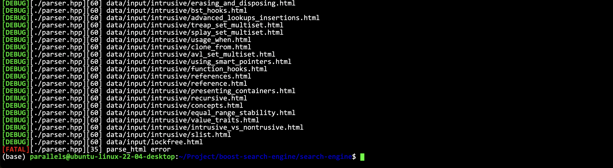


### Parsing HTML

```cpp
    static bool parse_html(const std::vector<std::string>& file_list, std::vector<doc_info_t>* results) {
        for (const std::string& file : file_list) {
            // 1. Read the file using read()
            std::string result;
            if (!ns_util::file_util::read_file(file, &result))
                continue;
            // 2. Parse the file and extract the title
            doc_info_t doc;
            if (!parse_title(result, &doc.__title))
                continue;
            // 3. Parse the file and extract the content
            if (!parse_content(result, &doc.__content))
                continue;
            // 4. Parse the file path and construct the URL
            if (!parse_url)
                continue;
            // If we reach here, parsing is complete and results are stored in doc
            results->push_back(doc); // note: this involves a copy, can be optimized
        }
        return true;
    }
```

This is straightforward — parse step by step.

```cpp
    static bool parse_title(const std::string& input, std::string* title) {
    }
    static bool parse_content(const std::string& input, std::string* content) {
    }
    static bool parse_url(/*?*/) {
    }
```

#### Parsing the Title

This part is simple — just extract the content between `<title>` and `</title>`.

```cpp
    static bool parse_title(const std::string& file, std::string* title) {
        // Extract the title
        std::size_t begin = file.find("<title>");
        if (begin == std::string::npos)
            return false;
        std::size_t end = file.find("</title>");
        if (begin == std::string::npos)
            return false;
        begin += std::string("<title>").size();
        if (begin > end) {
            return false;
        }
        *title = file.substr(begin, end - begin); // extract the title
        return true;
    }
```

#### Parsing the Content

Here I use a simple state machine. Two states: `LABEL` and `CONTENT`.

```cpp
    static bool parse_content(const std::string& file, std::string* content) {
        // Remove tags using a simple state machine
        enum status {
            LABLE,
            CONTENT
        };
        enum status s = LABLE;
        for (char c : file) {
            switch (s) {
            case LABLE:
                if (c == 'c') // the tag has been fully processed
                    s = CONTENT;
                break;
            case CONTENT:
                if (c == '<')
                    s = LABLE;
                else {
                    // we don't want to keep \n
                    if (c == '\n')
                        c = ' ';
                    content->push_back(c);
                }
                break;
            default:
                break;
            }
        }
    }
```

#### Parsing the URL

> [!TIP]
> The official Boost documentation and our downloaded resources have a corresponding path relationship.

Official documentation path: `https://www.boost.org/doc/libs/1_85_0/doc/html/accumulators.html`
Local data path: `data/input/accumulators.html`

We just need to handle the path mapping correctly.

```cpp
static const std::string url_head = "https://www.boost.org/doc/libs/1_85_0/doc/html";
```

```cpp
    static bool parse_url(const std::string& file_path, std::string* url) {
        std::string url_tail = file_path.substr(src_path.size());
        *url = url_head + url_tail;
        return true;
    }
```

### Saving Data to a Binary File

Optimize the write format.

To be able to use `std::getline` to directly read all content from a file, we define the following format:

> [!TIP]
> `title\3content\3url \n title\3content\3url \n title\3content\3url`

## Building the Index Module

### Preparation

```cpp
namespace ns_index {
typedef struct __doc_info {
    std::string __title; // document title
    std::string __content; // document content
    std::string __url; // document URL
    int __doc_id; // document ID
} doc_info_t;
class index {
    private:
};
```

Compared to the parser section, we added an `int __doc_id; // document ID` field here. How it is used will be explained later.

So we can directly define the forward index data structure:

```cpp
std::vector<doc_info_t> __forward_index; // forward index
```

For the inverted index, as mentioned earlier, it is a mapping from keywords to documents.

What are the keywords? We need to process them first.

```cpp
struct inverted_elem {
    int __doc_id;
    std::string __word;
    int __weight;
};
```
**Therefore, an inverted index must map a keyword to one or more `inverted_elem` entries!**

Thus, we can define the inverted index data structure:

```cpp
typedef std::vector<inverted_elem> inverted_list_t;
std::unordered_map<std::string, inverted_list_t> __inverted_index; // inverted index
```

### Basic Interface Structure

```cpp
    // Find document content by doc_id
    doc_info_t* get_forward_index(const uint64_t& doc_id) {
        return nullptr;
    }
    // Get the inverted list by keyword
    inverted_list_t* get_inverted_list(const std::string& word) {
        return nullptr;
    }
    // Build forward and inverted indexes from the tag-removed formatted documents
    bool build_index(const std::string& input) {
        // input: raw.bin
        return true;
    }
```

### Building the Index

#### Preparation

This is the most important part. Other parts, such as retrieving the forward or inverted index, are simply fetching data from a `vector` or `hash_map`, which is straightforward. The key logic lies in building the index.

```cpp
        std::ifstream in(input, std::ios::in | std::ios::binary);
        if (!in.is_open()) {
            LOG(ERROR) << "path file: " << input << " open error" << std::endl;
            return false;
        }
        std::string line;
        std::size_t cnt = 0; // represents the current line number
        while (std::getline(in, line)) {
            // Build the forward index
            doc_info* doc = __build_forward_index(line);
            if (doc == nullptr) {
                LOG(WARNING) << "build_forward_index error in line:" << cnt << std::endl;
                continue;
            }
            // Build the inverted index
            __build_inverted_index(*doc);
            cnt++;
        }
```

So we need to write two private methods to build the forward index and the inverted index.

#### Forward Index

The steps are as follows:

1. Parse the line by splitting the string
2. Fill the split strings into a `doc_info` struct
3. Insert into the forward index vector

So we need a function that splits a string into three parts, which can be placed in `util.hpp`.

```cpp
    doc_info* __build_forward_index(const std::string& line) {
        // 1. Parse the line by splitting the string
        std::vector<std::string> results; // final result
        ns_util::string_util::cut_string(line, &results, sep);
        if (results.size() != 3)
            // split failed
            return nullptr;
        // 2. Fill the strings into doc_info
        doc_info doc;
        doc.__title = results[0];
        doc.__content = results[1];
        doc.__title = results[2];
        doc.__doc_id = __forward_index.size();
        // 3. Insert into the forward index vector
        __forward_index.push_back(doc);
        return &__forward_index.back();
    }
```

For string splitting, we can use a method from the Boost library:

```cpp
    static void cut_string(const std::string& target, std::vector<std::string>* out, char sep) {
        // boost split
        boost::split(*out, target, boost::is_any_of(sep), boost::token_compress_on);
    }
```


#### Inverted Index

Principle:
- The interface receives formatted content including title, content, etc.
- Since we process documents one by one, a single document may contain multiple words, all of which should be associated with the current `doc_id`
- Ultimate goal: based on document content, generate one or more `inverted_elem` entries
- Therefore, we need to perform word segmentation on both the title and content
- Then we need to count word frequencies, and we can specifically set that words appearing in the title are considered more relevant
- After the above steps, we know how many times each word appears in the title and content of a document
- Then we define custom relevance: set title relevance to 10 and content relevance to 1

**Installing cppjieba:**

> [!TIP]
> https://github.com/yanyiwu/cppjieba

cppjieba is header-only, so you just need to include its header files. `include/cpp/*.hpp`

See the cppjieba README for specific details.

We only need to use the `CutForSearch` function from cppjieba; it has many other features as well.

**You should look at its demo.cpp**

Note: You need to manually copy the contents of `cppjieba/deps/limonp` into `cppjieba/include/cppjieba`, otherwise compilation will fail.

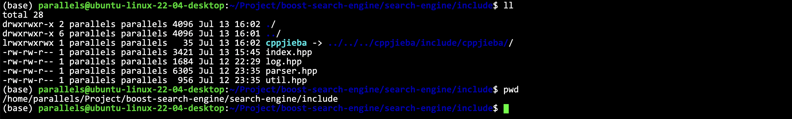

Place jieba in the corresponding header file directory.

Link `limonp` over.

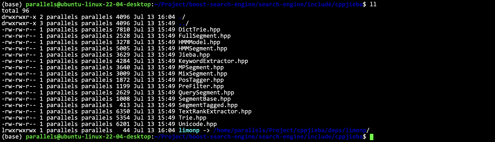

Bring in the dictionaries.

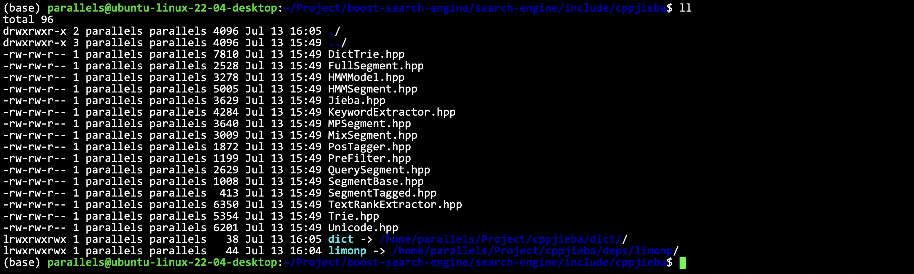

Since jieba is needed not only for building the inverted index but also during the search phase, we put it in `util.hpp` for unified management.

Import the dictionaries, set up the paths, and then call `CutForSearch`.

```cpp
const char* const DICT_PATH = "./cppjieba/dict/jieba.dict.utf8";
const char* const HMM_PATH = "./cppjieba/dict/hmm_model.utf8";
const char* const USER_DICT_PATH = "./cppjieba/dict/user.dict.utf8";
const char* const IDF_PATH = "./cppjieba/dict/idf.utf8";
const char* const STOP_WORD_PATH = "./cppjieba/dict/stop_words.utf8";
class jieba_util {
private:
    static cppjieba::Jieba jieba;
public:
    void cut_string(const std::string& src, std::vector<std::string>* out) {
        jieba.CutForSearch(src, *out);
    }
};
cppjieba::Jieba jieba_util::jieba(DICT_PATH, HMM_PATH, USER_DICT_PATH, IDF_PATH, STOP_WORD_PATH); // static members must be defined outside the class
```

Now we can complete the code for building the inverted index:

```cpp
    bool __build_inverted_index(const doc_info& doc) {
        struct word_count {
            int title_count;
            int content_count;
            word_count()
                : title_count(0)
                , content_count(0) { }
        };
        std::unordered_map<std::string, word_count> word_map; // temporary map for word frequency
        // Segment the title
        std::vector<std::string> title_words;
        ns_util::jieba_util::cut_string(doc.__title, &title_words);
        for (auto& s : title_words)
            word_map[s].title_count++;
        // Segment the content
        std::vector<std::string> content_words;
        ns_util::jieba_util::cut_string(doc.__content, &content_words);
        for (auto& s : content_words)
            word_map[s].content_count++;
        // Build the inverted list
        for (auto& word_pair : word_map) {
            inverted_elem item;
            item.__doc_id = doc.__doc_id;
            item.__word = word_pair.first;
            item.__weight = title_co_rate * (word_pair.second.title_count) + content_co_rate * (word_pair.second.content_count); // relevance
            // Insert into the inverted list
            inverted_list_t & inverted_list = __inverted_index[word_pair.first];
            inverted_list.push_back(item);
        }
    }
```

#### Handling a Remaining Issue

Obviously, search engines are case-insensitive, so we need to handle this.

## Building the Searcher Module

### Basic Code Structure

Building the index is the first step. Next, we need to search based on the index.

```cpp
namespace ns_searcher {
class searcher {
private:
    ns_index::index* __index; // index for system lookups
public:
    searcher() = default;
    ~searcher() = default;

public:
    void init_searcher(const std::string& input) {
        // 1. Get or create the index object
        // 2. Build the index using the index object
    }
    void search(const std::string& query, std::string* json_string) {
        // query: the search keyword
        // json_string: the search results returned to the user's browser
        // 1. Segment the query
        // 2. Lookup: search the index for each segmented word
        // 3. Merge and sort: aggregate results and sort by relevance in descending order
        // 4. Build: construct a JSON string from the results using jsoncpp
    }
};
} // namespace ns_searcher
```

How to perform a search:
1. Segment the query
2. Lookup: search the index for each segmented word
3. Merge and sort: aggregate results and sort by relevance in descending order
4. Build: construct a JSON string from the results using jsoncpp

### Making the Index a Singleton

Since the index is essentially constructed once and does not change afterward, we use the singleton pattern to avoid having too many index objects in the program.

There are thread safety issues when constructing a singleton, so we need to add locks. However, this is standard C++ and systems programming knowledge, so we won't elaborate here — see the code for details.

### Implementing the Search Function

Follow these steps to implement:
1. Segment the query
2. Lookup: search the index for each segmented word
3. Merge and sort: aggregate results and sort by relevance in descending order
4. Build: construct a JSON string from the results using jsoncpp

```cpp
    void search(const std::string& query, std::string* json_string) {
        // query: the search keyword
        // json_string: the search results returned to the user's browser
        // 1. Segment the query
        std::vector<std::string> query_words;
        ns_util::jieba_util::cut_string(query, &query_words);
        // 2. Lookup: search the index for each segmented word
        // Note: case-insensitive matching is needed here
        ns_index::inverted_list_t inverted_list_all; // contains inverted_elem entries
        for (std::string word : query_words) {
            boost::to_lower(word);
            // Must look up the inverted index first
            ns_index::inverted_list_t* inverted_list = __index->get_inverted_list(word); // look up inverted index
            if (nullptr == inverted_list)
                // No inverted index means no forward index either
                continue;
            inverted_list_all.insert(inverted_list_all.end(), inverted_list->begin(), inverted_list->end()); // batch insert
            // Note: inverted_list_all may have a remaining issue — document names could be duplicated
        }
        // 3. Merge and sort: aggregate results and sort by relevance in descending order
        std::sort(inverted_list_all.begin(), inverted_list_all.end(), [](const ns_index::inverted_elem& e1, const ns_index::inverted_elem& e2) {
            return e1.__weight > e2.__weight;
        });
        // 4. Build: construct a JSON string from the results using jsoncpp
        for (auto& item : inverted_list_all) {
            ns_index::doc_info* doc = __index->get_forward_index(item.__doc_id);
            if(nullptr == doc) continue;
            // serialize
        }
    }
```

After obtaining the results, we need to serialize them with jsoncpp.

**Installing jsoncpp**

I'm on Ubuntu 22.04:

> [!TIP]
> sudo apt install libjsoncpp-dev

For CentOS:

> [!TIP]
> sudo yum install -y jsoncpp-devel


Then include the corresponding header file `#include <jsoncpp/json/json.h>` — this is my path; the actual path depends on your version and setup.

The Makefile also needs the linker flag: `-ljsoncpp`.


Now we can complete the serialization step:

```cpp
        // 4. Build: construct a JSON string from the results using jsoncpp
        Json::Value root;
        for (auto& item : inverted_list_all) {
            ns_index::doc_info* doc = __index->get_forward_index(item.__doc_id);
            if (nullptr == doc)
                continue;
            // serialize
            Json::Value elem;
            elem["title"] = doc->__title;
            // doc->__content is the full tag-removed result, not what we want — we only need a portion. TODO
            elem["desc"] = doc->__content;
            elem["url"] = doc->__url;
            root.append(elem); // append to root in order
        }
        Json::StyledWriter writer;
        *json_string = writer.write(root); // serialize!
```

### Building the Test Server and Finishing Up

```cpp
#include "../include/searcher.hpp"

const std::string input = "./data/raw/raw.bin";

int main() {
    // for test
    ns_searcher::searcher * ser = new ns_searcher::searcher();
    ser->init_searcher(input);
    std::string query;
    std::string json_string;
    while(true) {
        std::cout << "input Query# ";
        std::cin >> query;
        ser->search(query, &json_string);
        std::cout << json_string << std::endl;
    }
    return 0;
}
```

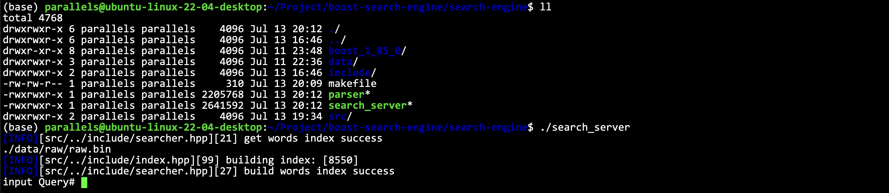

Enter "filesystem" as the query and check the results. Click on the links to verify they are correct.

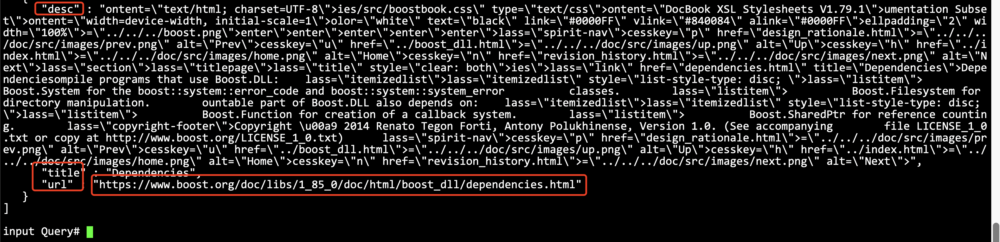


The links work correctly, which means our logic is sound. Of course, more thorough testing is still needed.

Let's first implement the snippet generation.

We obviously can't return the full text to the browser client.

The simplest approach would be to truncate the first 100 bytes, but that's not ideal. We want a better snippet that reflects the actual content. Ideally, we'd integrate an AI API to generate summaries, but here we use a simplified approach.

The strategy is as follows:

```cpp
    std::string get_desc(const std::string& html_content, const std::string& word) {
        // Find the first occurrence of word in html_content, then take n bytes before and m bytes after
    }
```

There are many details to pay attention to here! You need to debug extensively when writing this code to find issues.
```cpp
    std::string get_desc(const std::string& html_content, const std::string& word) {
        // Find the first occurrence of word in html_content, then take n bytes before and m bytes after
        const int prev_step = 150;
        const int next_step = 180;
        // 1. Find the first occurrence
        auto iter = std::search(html_content.begin(), html_content.end(), word.begin(), word.end(), [](int x, int y) { return std::tolower(x) == std::tolower(y); });
        if (iter == html_content.end())
            return "null: iter == html_content.end()"; // this case should never happen, because the text must contain the keyword
        std::size_t pos = std::distance(html_content.begin(), iter);
        // 2. Get start and end positions
        int start = 0; // don't use size_t to prevent underflow to negative
        int end = html_content.size() - 1;
        if (pos > start + prev_step)
            start = pos - prev_step;
        if ((int)pos < (int)(end - next_step))
            end = pos + next_step;
        // 3. Extract the substring
        if (start >= end)
            return "null: start >= end"; // impossible case
        return html_content.substr(start, end - start);
    }
```

## Setting Up the Network Service

### `cpp-httplib`

We use the cpp-httplib third-party library.

> [!NOTE]
> https://github.com/yhirose/cpp-httplib


> [!WARNING]
> 1. You need a relatively recent version of gcc/g++. My version is `gcc version 11.4.0 (Ubuntu 11.4.0-1ubuntu1~22.04)`
> 2. This is header-only — just include the header file
> 3. Some systems reset the gcc version to an older one every time a new bash session is started. You can add the startup command to `~/.bash_profile`. Of course, some systems already use the latest version. For specific upgrade instructions, refer to other resources.
> 4. It's recommended to use cpp-httplib version 0.7.15. If you use the latest version, make sure your gcc is also up to date.
> 5. You need to link with `-lpthread`

### Building the Basic Structure

```cpp
void build_server() {
    // Define the searcher
    ns_searcher::searcher ser;
    ser.init_searcher(resource_path);

    httplib::Server svr;
    svr.set_base_dir(root_path.c_str());
    svr.Get("/s", [&ser](const httplib::Request& req, httplib::Response& rsp) {
        // Set the parameter name for the user's keyword input to "word"
        if (!req.has_param("word")) {
            rsp.set_content("none key word, please enter your param", "text/plain; charset=utf-8");
            return;
        }
        // Keyword provided
        std::string word = req.get_param_value("word");
        std::string json_string; // search results
        ser.search(word, &json_string);
        rsp.set_content(json_string, "application/json; charset=utf-8");
    });
    svr.listen("0.0.0.0", 8081);
}
```
With this, we can search by keyword.

Let's do a quick test first:

Enter in the browser: `http://10.211.55.4:8081/s?word=filesystem` where the IP is your server's IP.

> [!NOTE]
> `/s` is the search path we set when defining the GET method. `?word=filesystem` means our parameter name is `word` and the value is `filesystem`. In the search code above, this searches for content related to "filesystem".

You can see the browser output:

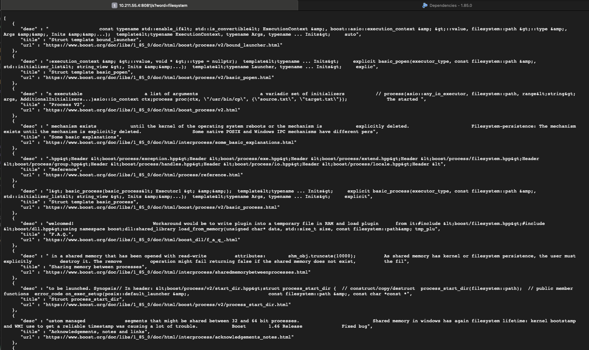

Of course, next we need to organize this content into a frontend!

## Building the Frontend Page

### HTML and CSS

Details omitted. See the code.

### JavaScript

We'll use jQuery. I'm using this CDN source:

```html
<script src="http://code.jquery.com/jquery-2.1.1.min.js"></script>
```

## Handling the Duplicate Document Problem

Why does the duplicate document problem occur?

For example, a document contains: I am a `student programmer`.

If you search for `student programmer`, two results might appear on the page, both pointing to the same document. This is easy to understand.

How to solve this problem?

We can define a special inverted list node specifically for display purposes:

```cpp
struct inverted_elem_print {
    uint64_t __doc_id;
    int __weight;
    std::vector<std::string> __words;
    inverted_elem_print()
        : __doc_id(0)
        , __weight(0) { }
};
```

Maintain a data structure for deduplication:

```cpp
std::unordered_map<uint64_t, inverted_elem_print> token_map;
```
